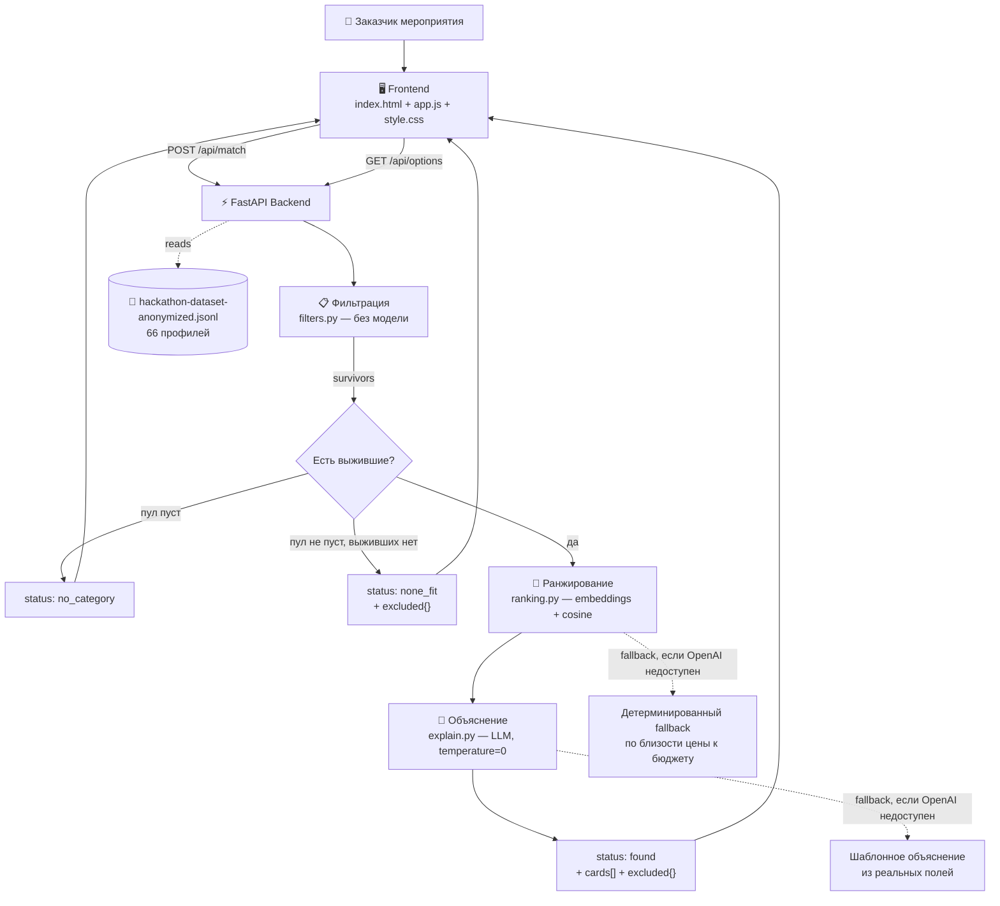
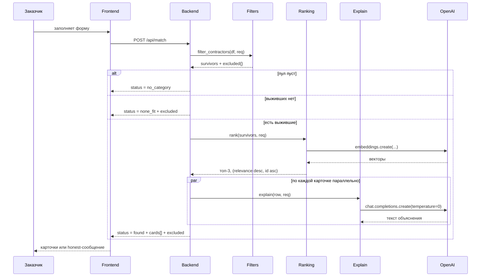

<div align="center">

# Contractor Matcher

### Smart Contractor Matching for Event Vendors

**Команда Anomaly Detected · HackAlem AI · Track 06 Creative Industries · кейс «Smart contractor matching» (Firebird)**

<p>
Детерминированная фильтрация • Семантическое ранжирование • Объяснения на реальных фактах • Без дообучения модели
</p>

<br>


<br><br>

###  Video Demo

_Будет добавлено перед Demo Day — пока что живые скриншоты пайплайна ниже, в разделе «Скриншоты»._

<br>

###  Ссылки

| Что | Где |
| --- | --- |
| Репозиторий | `git@github.com:BAITC-Hacks/hack-2cc01208-anomaly-detected.git` |
| Контракт API | [`docs/api.md`](./docs/api.md) |
| Условие задачи | [`../tracks/06-creative-industries/`](../tracks/06-creative-industries/) в рабочем репозитории подготовки |

</div>

---

##  Обзор

Пользователь-заказчик мероприятия вводит параметры (город, дата, тип события, категория подрядчика,
бюджет, опционально — язык и длительность) и получает до 3 карточек подрядчиков из каталога, каждая —
с конкретным объяснением, почему именно этот подрядчик подходит. Ценность решения — в объяснении,
а не в самой сортировке: это прямо прописано в условии задачи, и вся архитектура вокруг этого построена.

---

##  Возможности

* Детерминированная фильтрация по городу, категории, формату события, бюджету, занятости на дату, языку и длительности
* Семантическое ранжирование выживших кандидатов по эмбеддингам (без дообучения модели)
* Объяснение на карточку, сгенерированное LLM строго на реальных фактах — без общих фраз
* Структурированная причина отказа (`excluded`) для каждого не прошедшего фильтр — всегда в ответе, а не только при пустом результате
* Детерминированный fallback без AI на каждом шаге, зависящем от внешнего API
* Единый пайплайн для любой категории каталога, включая площадки («Банкетный зал» и т.п.) — без специального кейса
* 12 тестов, реально бьющих в живой OpenAI API, включая проверку неразличимости объяснений

---

##  Архитектура системы



---

##  Обработка запроса



---

##  Скриншоты

### Пустая форма

Данные для города/категории/формата/языка подтягиваются с `GET /api/options`.

<p align="center">
  
</p>

---

### Найдены подходящие подрядчики (`status: found`)

Каждая карточка — с ценой, категорией и объяснением на реальных фактах; ниже — честная разбивка,
почему остальные кандидаты этой категории/города не подошли.

<p align="center">
  
</p>

---

### Кандидаты есть, но никто не подошёл (`status: none_fit`)

Третий обязательный по условию задачи исход — явно отличим от «found» и от «no_category», с
разбивкой причин отказа.

<p align="center">
  
</p>

---

##  Структура репозитория

```text
hack-2cc01208-anomaly-detected
│
├── backend
│   ├── app
│   │   ├── config.py         — env-конфигурация (.env)
│   │   ├── data_loader.py    — чтение hackathon-dataset-anonymized.jsonl
│   │   ├── filters.py        — детерминированная фильтрация, статусы, excluded{}
│   │   ├── ranking.py        — embeddings + cosine, fallback без AI
│   │   ├── explain.py        — LLM-объяснения, fallback-шаблон
│   │   ├── matcher.py        — сборка filter → rank → explain в ответ API
│   │   └── server.py         — FastAPI: /api/match, /api/options, /health
│   ├── tests
│   │   ├── test_filters.py
│   │   ├── test_determinism.py
│   │   └── test_explanations.py
│   ├── demo_queries.py       — прогон обязательных по заданию сценариев
│   ├── requirements.txt
│   └── .env.example
│
├── frontend
│   ├── index.html            — форма запроса
│   ├── app.js                — fetch к API, рендер карточек/сообщений
│   └── style.css
│
├── data
│   └── hackathon-dataset-anonymized.jsonl   — 66 профилей подрядчиков
│
├── docs
│   └── api.md                — контракт frontend ↔ backend
│
├── screenshots                — реальные скриншоты живого прогона (см. выше)
│
└── README.md
```

---

##  API

Полный контракт — [`docs/api.md`](./docs/api.md). Кратко:

### `POST /api/match`

```http
POST /api/match
Content-Type: application/json
```

```json
{
  "city": "Алматы",
  "date": "2026-11-14",
  "event_type": "свадьба",
  "category": "Ведущий",
  "budget_kzt": 2000000,
  "hours": 5,
  "language": "казахский"
}
```

Ответ (`status: found`):

```json
{
  "status": "found",
  "message": "Found 2 matching contractor(s) out of 10 in this category/city.",
  "cards": [
    {
      "id": "HK-42352",
      "name": "Эмилия",
      "category": "Ведущий",
      "city": "Алматы",
      "price_from_kzt": 900000,
      "synthetic": false,
      "explanation": "..."
    }
  ],
  "excluded": {
    "busy_on_date": 5,
    "over_budget": 0,
    "wrong_format": 4,
    "wrong_language": 5,
    "too_few_hours": 0
  }
}
```

`status` принимает три значения: `found` (1-3 карточки), `no_category` (такой категории в этом
городе нет вообще), `none_fit` (кандидаты есть, но никто не прошёл фильтры). `excluded` присутствует
в ответе **всегда**, включая `found` — это явное требование контракта.

### `GET /api/options`

```json
{"cities": [...], "categories": [...], "event_formats": [...], "languages": [...]}
```

### `GET /health`

```json
{"status": "ok", "contractors_loaded": 66}
```

---

##  Данные

`data/hackathon-dataset-anonymized.jsonl` — 66 профилей подрядчиков, партнёрский анонимизированный
датасет, JSON-объект на строку.

| Категория | Профилей |
| --- | --- |
| Ведущий | 15 |
| Фотограф | 12 |
| Банкетный зал | 8 |
| Ресторан | 7 |
| Остальные (Лайв-бэнд, Шоу-программа, Видеограф и т.д.) | 4-5 |
| Флорист, Декоратор, Подарки и сувениры, Ведущий церемонии, Фото и видеобудки, Отель, Инструменталист | 3 каждая |

Поле `synthetic` сохраняется на всём пути до карточки в ответе API. `load_contractors()` в
`backend/app/data_loader.py` принимает список `extra_synthetic` — если понадобится дополнить датасет
для покрытия демо-сценария, такие профили останутся явно отличимыми от настоящих.

---

##  Детерминизм и устойчивость

| Требование условия задачи | Как реализовано |
| --- | --- |
| Один и тот же запрос → один и тот же порядок карточек | `id` как вторичный ключ сортировки при равном `relevance`, `temperature=0` на генерации объяснений |
| Разные даты → разная выдача, видно, что дело в занятости | Занятость проверяется по `busy_dates` подрядчика; `excluded.busy_on_date` явно показывает причину |
| Категория-площадка — тот же пайплайн, без спецкейса | «Банкетный зал» и подобные проходят через тот же `filter_contractors`, что и любая другая категория |
| Ответ за разумное время (до 10 секунд) | Параллельные вызовы объяснений на карточку — полный ответ на 3 карточки укладывается в 3-4 секунды «в тепле» |
| Демо не должно зависеть от доступности внешнего API | Детерминированный fallback без модели на ранжировании и объяснениях — статусы и структура ответа не меняются |

---

##  Тесты

```bash
cd backend
pytest tests/ -v
```

12 тестов, реально бьют в живой OpenAI API:

* все три статуса (`found` / `no_category` / `none_fit`) достижимы на реальных данных
* `excluded` всегда присутствует и корректно посчитан, включая случай `found`
* занятость, язык, длительность реально исключают неподходящих; `max_hours = null` никогда не исключается фильтром по длительности
* категория-площадка проходит через общий пайплайн
* повторный запуск с теми же параметрами → тот же порядок карточек
* объяснения двух карточек не совпадают даже после замены имени на `<NAME>`

Воспроизводимость проверена вручную: `pip install -r requirements.txt` в чистом venv + `pytest` → 12/12 без ручного вмешательства.

---

##  Демо-сценарии

```bash
cd backend
python demo_queries.py
```

Прогоняет 5 сценариев, три из которых прямо требуются условием задачи:

1. Плотная категория на осеннюю дату (Фотограф, Алматы) — где ранжирование реально решает
2. Редкая категория (Флорист, 3 профиля)
3. Запрос без результата (нереалистичный бюджет в пиковую дату)
4. Категория-площадка («Банкетный зал») — тот же пайплайн, что и для любого другого подрядчика
5. Комбинация фильтров по языку и длительности

---

##  Install & Run

###  Backend

```bash
cd backend
pip install -r requirements.txt
cp .env.example .env        # вписать свой OPENAI_API_KEY
python -m uvicorn app.server:app --port 8000
```

Backend поднимется на:

```text
http://localhost:8000
```

Без `OPENAI_API_KEY` (или при исчерпанной квоте) сервис всё равно работает — ранжирование и
объяснения переключаются на детерминированный fallback, статус ответа не меняется.

###  Frontend

```bash
cd frontend
python -m http.server 5500
```

Открыть:

```text
http://localhost:5500
```

Backend должен быть уже запущен на `:8000`. CORS настроен как `allow_origins=["*"]`, так что порт
фронта значения не имеет. Открывать `index.html` напрямую как `file://` не стоит — часть браузерных
политик режет такие запросы к `localhost`.

---

##  Соответствие критериям оценки

| Критерий (из условия задачи) | Баллы | Что в проекте это покрывает |
| --- | --- | --- |
| Соответствие задаче и работоспособность | 25 | Все пункты «Требования» реализованы буквально: 3 статуса, `excluded` всегда, детерминизм, площадки как обычная категория |
| Техническая реализация | 25 | Чёткое разделение слоёв (фильтр → ранжирование → объяснение), переиспользование проверенного embed+cosine паттерна, параллелизация LLM-вызовов, graceful fallback на каждом AI-зависимом шаге |
| README и воспроизводимость | 25 | Этот файл: архитектура с диаграммами, контракт, данные, запуск, тесты, демо, реальные скриншоты — весь путь пройден в чистом venv |
| Ценность и применимость решения | 15 | Объяснения строятся из реальных полей подрядчика и запроса, не из шаблонных фраз |
| Потенциал развития и оригинальность | 10 | `excluded`-breakdown как структурированная обратная связь, расширяемый список синтетических профилей, единый пайплайн для любой категории каталога |

---

##  Известные ограничения

* Без валидного `OPENAI_API_KEY` с доступной квотой ранжирование и объяснения работают в
  fallback-режиме — текст объяснений получается более механическим (см. поле `explanation_source`
  в каждой карточке: `"llm"` или `"template"`).
* Нет бронирования, заявок или уведомлений подрядчику — только рекомендация, согласно условию задачи.
* Нет сложного UI сверх формы и карточек результата — согласно прямому указанию в условии
  («если выбирать между интерфейсом и качеством объяснений — берите объяснения»).

---

##  Команда

**Anomaly Detected** · HackAlem AI 2026

* Rahim Ahmed Druba — [@rahim_druba17](https://t.me/rahim_druba17)
* Samiullah Lalee — [@Samiullahlaly](https://t.me/Samiullahlaly)
* Ермұқасан Төлегенұлы — [@alooxaa](https://t.me/alooxaa)
