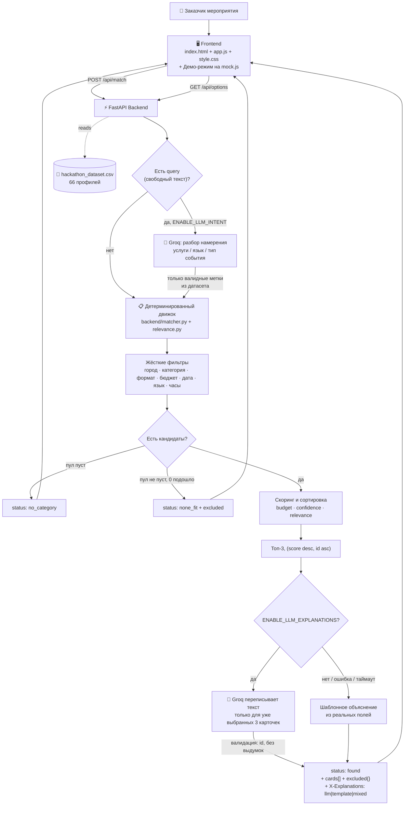
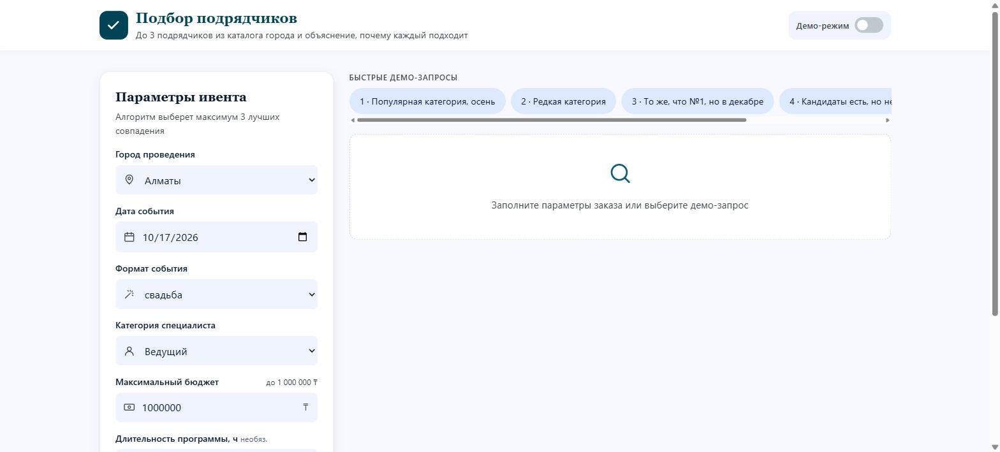
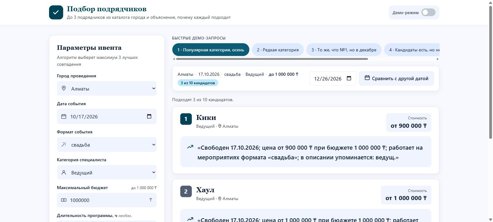
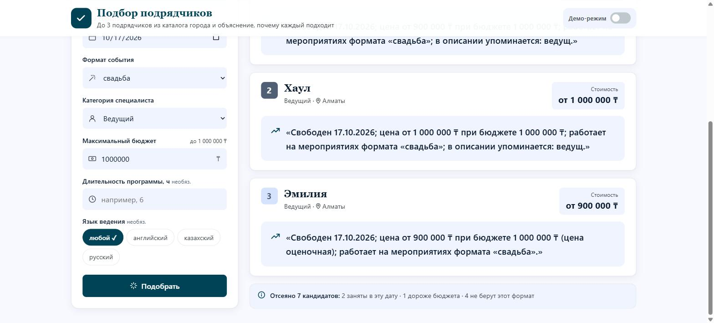
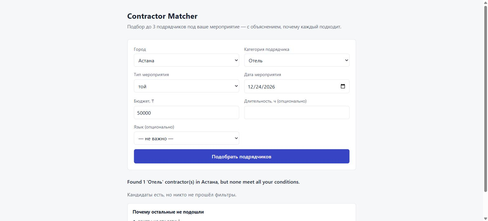
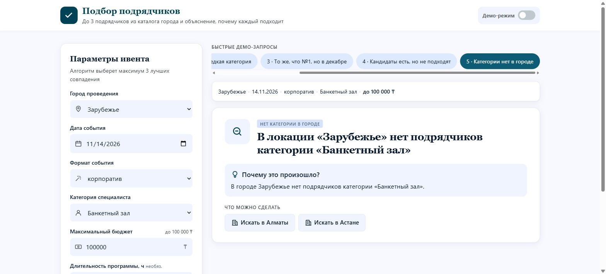
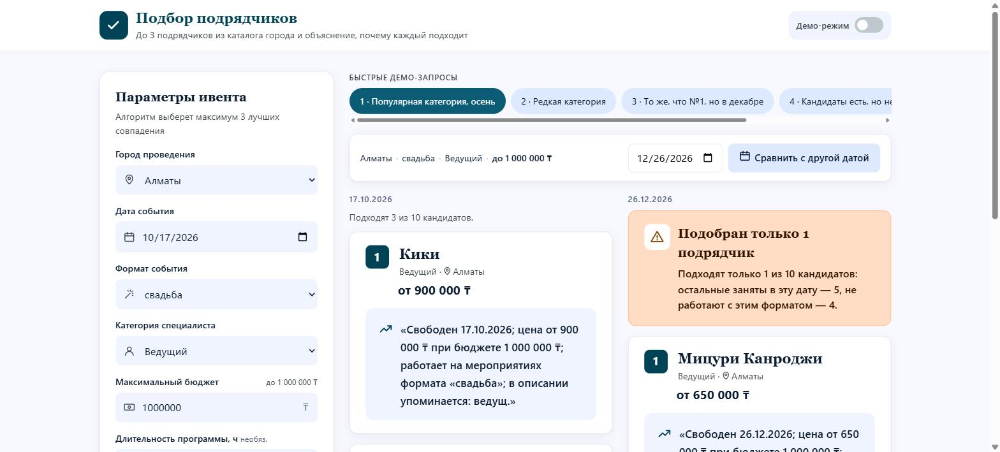

<div align="center">

# Contractor Matcher

### Smart Contractor Matching for Event Vendors

**Команда Anomaly Detected · HackAlem AI · Track 06 Creative Industries · кейс «Smart contractor matching» (Firebird)**

<p>
Детерминированная фильтрация и ранжирование • AI не выбирает подрядчика • Понимание запроса и объяснения — опциональный слой Groq
</p>

<br>


<br><br>

###  Video Demo

_Будет добавлено перед Demo Day — пока что живые скриншоты пайплайна ниже, в разделе «Скриншоты»._

<br>

###  Ссылки

| Что | Где |
| --- | --- |
| Репозиторий | `git@github.com:BAITC-Hacks/hack-2cc01208-anomaly-detected.git` |
| Контракт API | [`docs/api.md`](./docs/api.md) |
| Условие задачи | [`docs/task.md`](./docs/task.md) |
| Литературный обзор | [`docs/literature-review.md`](./docs/literature-review.md) |

</div>

---

##  Обзор

Пользователь-заказчик мероприятия вводит параметры (город, дата, тип события, категория подрядчика,
бюджет, опционально — язык, длительность и свободный текст запроса) и получает до 3 карточек
подрядчиков из каталога, каждая — с конкретным объяснением, почему именно этот подрядчик подходит.
Ценность решения — в объяснении, а не в самой сортировке: это прямо прописано в условии задачи.

**Главный архитектурный принцип: AI не выбирает победителя.** Кто подходит, в каком порядке и с
каким счётом — решает детерминированный Python-код. AI (Groq) используется только там, где это не
меняет результат: разбор свободного текста в структурированные метки и переписывание текста уже
выбранных объяснений.

---

##  Почему такая архитектура — коротко

Полный разбор — в [`docs/literature-review.md`](./docs/literature-review.md), здесь только вывод.
Задача сужается по четырём шагам:

1. Рекомендации подрядчиков в двусторонних сервис-маркетплейсах — изученная задача с реальной
   экономической ценностью (Shi, *Management Science*, 2024 — оптимальная политика рекомендаций
   для платформ вроде Angi/HomeAdvisor/Thumbtack).
2. При тонком датасете без истории взаимодействий (66 профилей, без рейтингов) знание-based /
   constraint-based рекомендеры — стандартный ответ, а не наш произвольный выбор: они не страдают
   от cold-start и **объясняют отказ даже когда решения нет** (Felfernig & Burke, ICEC 2008) — это
   прямое обоснование, почему `none_fit`/`no_category` — полноправные статусы API, а не заглушки.
3. В домене свадебных/event-подрядчиков уже есть публикации (Kesuma et al., 2020; Singh et al.,
   2020) — обе про числовой скор, без сгенерированного объяснения, и обе явно фиксируют cold-start
   (точность 84%→54% для новых пользователей). Наш кейс ровно в этой яме, только с честным выходом.
4. Использование LLM именно для объяснения уже выбранной рекомендации — редкий паттерн (в обзоре
   2025 года из 232 статей только 6 реально это делают), и именно поэтому нужен слой валидации:
   мы не доверяем Groq вывод, а проверяем его по реальным id/полям и откатываемся на шаблон при
   любой ошибке — тот же neuro-symbolic паттерн, что в SYNAPSE (2025) поднял точность до ~94% в
   совершенно другом домене (строительная инженерия).

Итог: комбинация «честный отказ + валидированное объяснение на тонких данных» для этого домена нигде
в разобранных работах не встречается вместе — см. таблицу сравнения в полном обзоре.

---

##  Возможности

* Детерминированная фильтрация по городу, категории, формату события, бюджету, занятости на дату, языку и длительности
* Детерминированное ранжирование по бюджету, уверенности в данных и релевантности категории/описания — без модели
* Опциональный слой Groq поверх уже готового результата: переписывает только текст объяснения (валидируется по id, без выдуманных чисел, с fallback на шаблон при любой ошибке/таймауте)
* Опциональный разбор свободного текста запроса («нужен фотограф и видеограф») в структурированные метки — мягкий сигнал для ранжирования, не фильтр (кроме явно обязательного языка)
* Структурированная причина отказа (`excluded`) для каждого не прошедшего фильтр — всегда в ответе, включая `found`
* Демо-режим на фронтенде: работает вообще без бэкенда, на заранее просчитанных mock-ответах — для показа жюри без риска сетевых сбоев
* Сравнение одного запроса на двух датах бок о бок — наглядно показывает, что разница именно в занятости
* Для `none_fit` — разбивка условий по карточкам «какое условие сколько кандидатов отсеяло» и визуальная воронка отсева; для `no_category` — предложение соседних городов, где категория есть
* 95 тестов: 422 на невалидный ввод, детерминизм, «AI никогда не меняет состав/порядок карточек» — проверено явно, а не предполагается

---

##  Архитектура



Два эндпоинта поверх одного и того же движка:

* **`POST /match`** — детальный эндпоинт для разработчиков: полный `score_breakdown`, `limit`, поле `services`.
* **`POST /api/match`** — адаптер под контракт фронтенда (`docs/api.md`): те же первые 3 результата `/match`, только переименованные поля и оформленный ответ. Покрыто тестами напрямую: для эквивалентных запросов `cards` — ровно первые 3 результата `/match` в том же порядке.

---

##  Скриншоты

### Пустая форма

Списки городов/категорий/форматов/языков подтягиваются с `GET /api/options`.

<p align="center">
  
</p>

---

### Найдены подходящие подрядчики (`status: found`)

Нумерованные карточки с объяснением на реальных фактах и честным счётчиком «подходят N из M кандидатов».

<p align="center">
  
</p>

---

### Прозрачность подбора

Сколько кандидатов отсеяно и по какой причине — раскрывается для любого исхода, не только для пустого.

<p align="center">
  
</p>

---

### Кандидаты есть, но никто не подошёл (`status: none_fit`)

Сайдбар «Заданные условия» подсвечивает, какое именно условие (дата, бюджет...) сколько кандидатов отсеяло, плюс визуальная воронка отсева по всем причинам.

<p align="center">
  
</p>

---

### Такой категории нет в этом городе (`status: no_category`)

Третий обязательный по условию задачи исход — явно отличим от двух других, с предложением попробовать соседний город.

<p align="center">
  
</p>

---

### Сравнение с другой датой

Один и тот же запрос, две даты рядом — наглядно видно, что разница в результате связана именно с занятостью, а не со случайностью.

<p align="center">
  
</p>

---

##  Структура репозитория

```text
hack-2cc01208-anomaly-detected
│
├── backend
│   ├── main.py            — FastAPI: /health, /match, /api/match, /api/options
│   ├── models.py          — Contractor, MatchRequest, ScoreBreakdown
│   ├── data_loader.py     — чтение и валидация hackathon_dataset.csv
│   ├── matcher.py         — жёсткие фильтры + сборка excluded{}
│   ├── relevance.py       — детерминированный скоринг (budget/confidence/relevance)
│   ├── frontend_api.py    — адаптер /match → контракт /api/match
│   ├── intent_parser.py   — опционально: Groq извлекает метки из query
│   ├── llm_explainer.py   — опционально: Groq переписывает текст объяснений
│   ├── conftest.py, test_*.py   — 95 тестов
│   └── __init__.py
│
├── frontend
│   ├── index.html         — форма запроса + переключатель демо-режима
│   ├── app.js              — fetch к API, рендер карточек, сравнение дат, воронка отсева
│   ├── mock.js              — готовые ответы для демо-режима (без бэкенда)
│   └── style.css
│
├── data
│   └── hackathon_dataset.csv   — 66 профилей подрядчиков
│
├── docs
│   ├── api.md              — контракт frontend ↔ backend, обе схемы (/match и /api/match)
│   └── task.md              — условие кейса (копия из Google Doc организаторов)
│
├── screenshots              — реальные скриншоты живого прогона (см. выше)
│
├── requirements.txt, pytest.ini, .env.example
└── README.md
```

---

##  API

Полный контракт — [`docs/api.md`](./docs/api.md). Кратко для `/api/match` (то, что реально использует фронтенд):

### `POST /api/match`

```http
POST /api/match
Content-Type: application/json
```

```json
{
  "city": "Алматы",
  "date": "2026-11-14",
  "event_type": "свадьба",
  "category": "Ведущий",
  "budget_kzt": 2000000,
  "hours": 5,
  "language": "казахский"
}
```

Ответ (`status: found`):

```json
{
  "status": "found",
  "message": "Подходят только 2 из 8 кандидатов: остальные заняты в эту дату — 2, не работают с этим форматом — 4.",
  "cards": [
    {
      "id": "HK-16628",
      "name": "Нобара Кугисаки",
      "category": "Фотограф",
      "city": "Алматы",
      "price_from_kzt": 600000,
      "synthetic": false,
      "explanation": "Свободен 15.10.2026; цена от 600 000 ₸ при бюджете 2 000 000 ₸; работает на мероприятиях формата «корпоратив»; в описании упоминается: фотограф.",
      "alternative": false
    }
  ],
  "excluded": {
    "busy_on_date": 2,
    "over_budget": 0,
    "wrong_format": 4,
    "wrong_language": 0,
    "too_few_hours": 0
  },
  "service_intent": null,
  "interpreted_intent": null
}
```

`status` принимает три значения: `found` (1-3 карточки), `no_category` (такой категории в этом
городе нет вообще), `none_fit` (кандидаты есть, но никто не прошёл фильтры). `excluded` считается
среди кандидатов нужного города и категории и **мутуально исключающе**: каждый отсеянный кандидат
учтён ровно один раз, по первому нарушенному правилу — счётчики не задваиваются.

Заголовок ответа `X-Explanations: llm | mixed | template` показывает, использовал ли Groq для
переписывания текста, и для скольких карточек.

### `GET /api/options`

```json
{"cities": [...], "categories": [...], "event_formats": [...], "languages": [...]}
```

Опционально по контракту — если недоступен, фронтенд использует захардкоженный список.

### `GET /health`

```json
{"status": "ok", "contractors_loaded": 66}
```

---

##  Данные

`data/hackathon_dataset.csv` — 66 профилей подрядчиков, партнёрский анонимизированный датасет.

| Категория | Профилей |
| --- | --- |
| Ведущий | 15 |
| Фотограф | 12 |
| Банкетный зал | 8 |
| Ресторан | 7 |
| Остальные (Лайв-бэнд, Шоу-программа, Видеограф и т.д.) | 4-5 |
| Флорист, Декоратор, Подарки и сувениры, Ведущий церемонии, Фото и видеобудки, Отель, Инструменталист | 3 каждая |

Поле `synthetic` сохраняется на всём пути до карточки в ответе API. Демо-режим фронтенда (`mock.js`)
уже включает один явно синтетический профиль («Тихиро Огино», Флорист) для показа редкой категории
без зависимости от бэкенда — с честной пометкой `synthetic: true`.

---

##  Детерминизм и устойчивость

| Требование условия задачи | Как реализовано |
| --- | --- |
| Один и тот же запрос → один и тот же порядок карточек | Сортировка `(score desc, id asc)`; `/api/match` доказанно даёт те же первые 3 id, что и `/match` для эквивалентного запроса |
| AI не меняет состав/порядок/фильтры | Groq трогает только текст `explanation` уже выбранных карточек; проверено тестами `test_llm_explainer.py`, `test_service_intent.py` |
| Разные даты → разная выдача, видно, что дело в занятости | `excluded.busy_on_date` явно показывает причину; UI показывает обе даты бок о бок |
| Категория-площадка — тот же пайплайн, без спецкейса | «Банкетный зал» и подобные проходят через тот же `matcher.py`, что и любая другая категория |
| Демо не должно зависеть от доступности внешнего API | Без `GROQ_API_KEY` или при `ENABLE_LLM_EXPLANATIONS=false` — работает полностью детерминированно; фронтенд дополнительно умеет работать вовсе без бэкенда (демо-режим) |
| Невалидный ввод обрабатывается, а не роняет сервис | `422` на некорректную дату, бюджет ≤ 0, `duration_hours` ≤ 0, `limit` вне диапазона — покрыто тестами |

---

##  Тесты

```bash
pip install -r requirements.txt
pytest
```

**95 тестов, ни один не требует реального `GROQ_API_KEY`** — Groq-зависимости подменяются на `None`/фейки
через FastAPI dependency injection (`get_explainer`, `get_intent_parser`), поэтому тесты быстрые (~30 секунд) и
не зависят от сети или квоты:

* `test_matcher.py`, `test_api.py` — фильтры, скоринг, детерминизм, `422` на невалидный ввод
* `test_frontend_api.py` — `/api/match` даёт ровно первые 3 результата `/match` в том же порядке, `excluded`-контракт
* `test_intent_parser.py`, `test_llm_explainer.py`, `test_service_intent.py` — опциональные Groq-слои никогда не меняют состав/порядок карточек, валидация вывода (только известные id, без выдуманных фактов), fallback на любую ошибку
* `test_options.py` — форма `GET /api/options`, согласованность с тем, что реально принимает `/api/match`

Воспроизводимость проверена вручную: установка зависимостей + `pytest` в чистом окружении → всё зелёное без ручного вмешательства.

---

##  Install & Run

###  Backend

```bash
pip install -r requirements.txt
cp .env.example .env        # опционально: вписать свой GROQ_API_KEY
uvicorn backend.main:app --reload
```

Backend поднимется на:

```text
http://localhost:8000
```

Swagger: `http://localhost:8000/docs`.

Без `GROQ_API_KEY` (или при `ENABLE_LLM_EXPLANATIONS=false`/`ENABLE_LLM_INTENT=false`) сервис работает
полностью детерминированно — разбора свободного текста и переписывания объяснений не будет, поведение
фильтров и ранжирования не меняется.

###  Frontend

```bash
cd frontend
python -m http.server 5500
```

Открыть `http://localhost:5500`. Backend должен быть уже запущен на `:8000` (CORS открыт, `allow_origins=["*"]`).

Можно и **без бэкенда вообще** — включить «Демо-режим» переключателем в правом верхнем углу: все
5 обязательных по заданию сценариев отвечают из `frontend/mock.js` мгновенно.

---

##  Соответствие критериям оценки

| Критерий (из условия задачи) | Баллы | Что в проекте это покрывает |
| --- | --- | --- |
| Соответствие задаче и работоспособность | 25 | Все 3 статуса, `excluded` всегда, детерминизм, площадки как обычная категория, `422` на невалидный ввод |
| Техническая реализация | 25 | Чёткое разделение слоёв (детерминированный движок отдельно от опциональных AI-слоёв), dependency injection для тестируемости без сети, валидация LLM-вывода против датасета, fallback на каждом AI-зависимом шаге |
| README и воспроизводимость | 25 | Этот файл: архитектура с диаграммой, контракт, данные, запуск, тесты, реальные скриншоты — весь путь пройден с чистой установкой зависимостей |
| Ценность и применимость решения | 15 | Объяснения строятся из реальных полей подрядчика; демо-режим убирает риск сетевого сбоя на самой презентации; воронка отсева и подсказки при `no_category` реально помогают пользователю, а не просто показывают отказ |
| Потенциал развития и оригинальность | 10 | Разбор намерения из свободного текста (`service_intent`, `interpreted_intent`) как расширяемый, но безопасный (валидируемый) AI-слой поверх детерминированного ядра; архитектурный выбор обоснован литературой, а не интуицией — см. [`docs/literature-review.md`](./docs/literature-review.md) и таблицу сравнения с прежними работами |

---

##  Известные ограничения

* Без `GROQ_API_KEY` объяснения — детерминированный шаблон, а не естественный текст (см. заголовок `X-Explanations` в каждом ответе).
* Нет бронирования, заявок или уведомлений подрядчику — только рекомендация, согласно условию задачи.
* Нет сложного UI сверх формы и карточек результата — согласно прямому указанию в условии
  («если выбирать между интерфейсом и качеством объяснений — берите объяснения»).

---

##  Команда

**Anomaly Detected** · HackAlem AI 2026

* Rahim Ahmed Druba — [@rahim_druba17](https://t.me/rahim_druba17)
* Samiullah Lalee — [@Samiullahlaly](https://t.me/Samiullahlaly)
* Ермұқасан Төлегенұлы — [@alooxaa](https://t.me/alooxaa)
